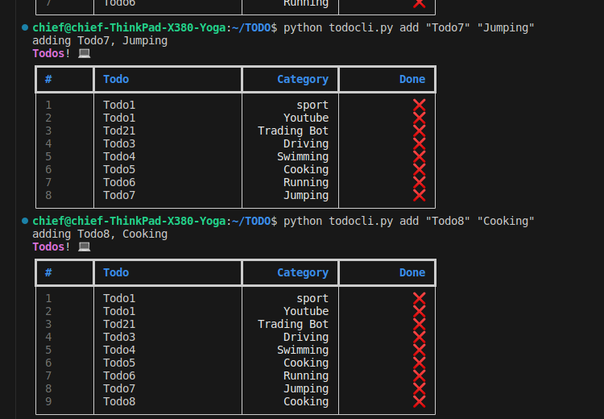

## TODO

Todo is an aplication that you can add a your task and modify them by either deleting them 
or marking them as  complete.

# Tools 
This application has been built with the following :

- Python
- sqlLite

# Features 
The following features are available :
- Adding of a task at TODO
- Marking the task as complete
- Deleting a Task from the Todo
- Modifing a Task you added in the Todo

# Screenshot 

# Installation and how to run the TODO

# How to use the TODO

# license
The project is licensed under MIT License
